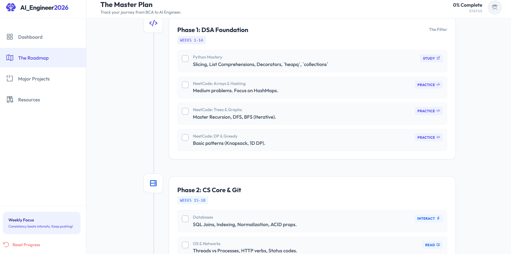

# 🚀 AI Engineer 2026: The Master Plan

<div align="center">


**An interactive, single-file dashboard to track the journey from Student to AI Engineer.**
<br />
*Zero dependencies. Zero setup. Local storage persistence.*

[View Live Demo](https://avinashnegi1999.github.io/AI-Software-Enginner-Roadmap/) · [Report Bug](https://github.com/avinashnegi1999/AI-Software-Enginner-Roadmap/issues) · [Request Feature](https://github.com/avinashnegi1999/AI-Software-Enginner-Roadmap/issues)

</div>

---

## 📖 About The Project

This repository contains **The Master Plan**, a self-contained web application designed to track your study progress through a rigorous 40-week roadmap. Unlike static markdown lists, this is a fully interactive dashboard.

It is tailored for students aiming for **Top-Tier Software & AI Engineering roles** (FAANG/MS in Germany) by 2026.

### ✨ Key Features

* **📊 Visual Dashboard:** Real-time visualization of your progress using **Chart.js**. Includes a "Skills Radar" to balance DSA, Development, and AI skills.
* **💾 Local Persistence:** Uses `localStorage` to save your progress automatically. Close the browser, come back later, and your checkboxes remain checked.
* **⚡ Single-File Architecture:** No `npm install`, no React build steps, no backend. Just one `index.html` file powered by Tailwind CDN.
* **🗺️ Strategic Phases:** Broken down into 5 distinct phases (DSA, Core, Web/DevOps, AI, Capstone).
* **📱 Responsive:** Works beautifully on Desktop and Mobile.

---

## 🛠️ Tech Stack

* **Structure:** Semantic HTML5
* **Styling:** [Tailwind CSS](https://tailwindcss.com/) (via CDN)
* **Icons:** [Phosphor Icons](https://phosphoricons.com/)
* **Data Visualization:** [Chart.js](https://www.chartjs.org/)
* **Logic:** Vanilla JavaScript

---

## 📸 Screenshots

| **Mission Control** | **The Roadmap** |
|:---:|:---:|
|  |  |

---

## 🚀 Getting Started

Because this is a serverless, single-file application, installation is instant.

### Option 1: Run Locally
1.  **Clone the repo**
    ```bash
    git clone [https://github.com/avinashnegi1999/AI-Software-Enginner-Roadmap.git](https://github.com/avinashnegi1999/AI-Software-Enginner-Roadmap.git)
    ```
2.  **Open the file**
    Navigate to the folder and double-click `index.html`. It will open in your default browser.

### Option 2: Live Version
You can access the hosted version directly here:
**[https://avinashnegi1999.github.io/AI-Software-Enginner-Roadmap/](https://avinashnegi1999.github.io/AI-Software-Enginner-Roadmap/)**

---

## 🗺️ The Roadmap Phases

The application tracks your progress through these specific domains:

### 🟢 Phase 1: DSA Foundation (Weeks 1-14)
* **Focus:** Python Mastery, NeetCode 150.
* **Key Topics:** Arrays, Hashing, Trees, Graphs, DP, Heap.

### 🔵 Phase 2: CS Core & Git (Weeks 15-18)
* **Focus:** Computer Science Fundamentals.
* **Key Topics:** SQL, Normalization, OS Threads/Processes, Git Flow.

### 🟢 Phase 3: Web Stack & DevOps (Weeks 19-30)
* **Focus:** Modern Full Stack Development.
* **Key Topics:** React, Next.js, FastAPI, Docker, CI/CD.

### 🟠 Phase 4: AI Engineering (Weeks 31-34)
* **Focus:** Bridging Software Engineering with AI.
* **Key Topics:** Linear Algebra, PyTorch Tensors, RAG Pipelines, Vector DBs (Pinecone).

### 🟣 Phase 5: The Capstone (Weeks 35-40)
* **Focus:** Building a production-grade application.
* **Project Options:** `ResumeAI Assistant` or `EduNexus LMS`.

---

## 🎨 Customization

Want to change the roadmap? It's easy.

1.  Open `index.html` in a code editor (VS Code).
2.  Search for `<div id="view-roadmap">`.
3.  Copy and paste an existing `task-item` block.
4.  **Crucial:** Ensure the new checkbox has a unique ID (e.g., `id="task-16"`).
5.  Update the `TASKS` object in the `<script>` tag at the bottom to include your new ID in the calculations.

```javascript
// Example: Adding a new task to Phase 1
const TASKS = {
    ids: [..., 'task-16'],
    weights: {
        'phase1': [1, 2, 3, 4, 16], // Added 16 here
        ...
    }
};
